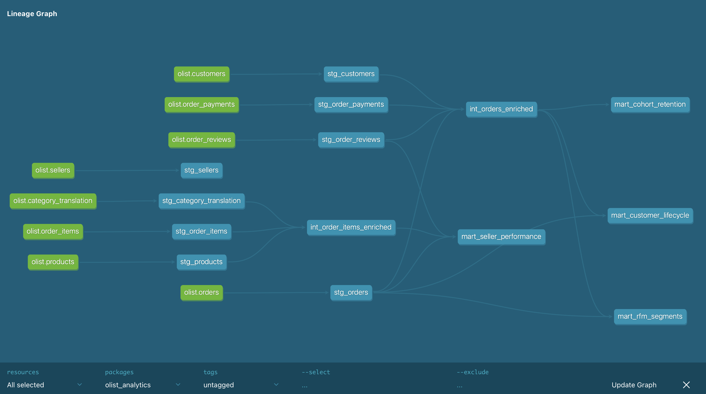
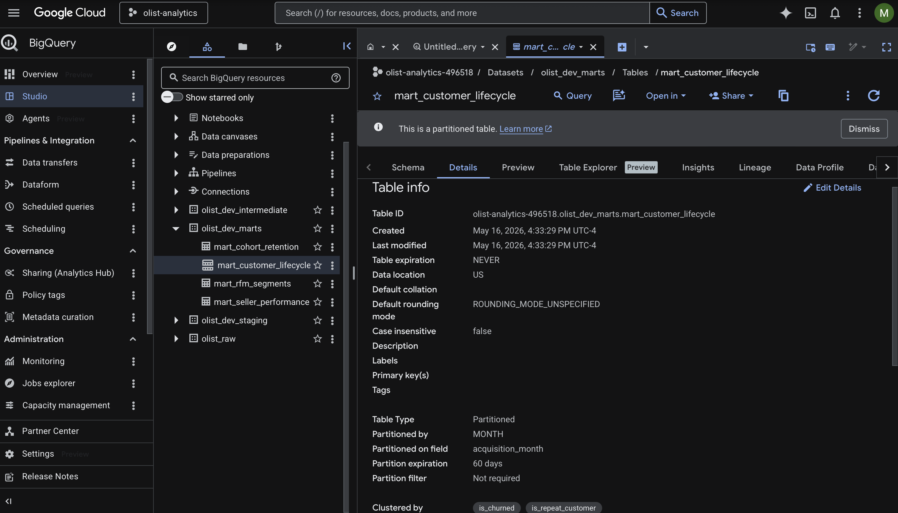

# 📌 Customer Segmentation & RFM Analysis

An end-to-end cloud analytics pipeline built on the [Olist Brazilian E-Commerce Dataset](https://www.kaggle.com/datasets/olistbr/brazilian-ecommerce) — 100,000+ orders across Brazil from 2016 to 2018.

Raw CSV data flows through **BigQuery → dbt → Tableau**, with RFM segmentation, cohort retention, A/B testing, and a deployed Streamlit app.

---

## 🔗 Live Application

**[🚀 Live Dashboard → customer-segmentation-rfm-analysis.streamlit.app](https://customer-segmentation-rfm-analysis.streamlit.app)**

| Tab | What it covers |
|-----|----------------|
| **Overview** | Total revenue, order volume, growth trajectory, state & city breakdown |
| **Customers** | RFM segmentation (96k customers), cohort retention heatmap & curves |
| **Products & Payments** | Category performance vs. review scores, payment method behavior |
| **Operations** | On-time delivery rate, review score distribution, seller leaderboard |
| **Experiments** | Two A/B test results: win-back discount & free shipping threshold |
| **Dashboards & Notebook** | Embedded Tableau dashboards + rendered Jupyter notebook |

---

## 🏗️ Architecture

```
Kaggle CSVs
    ↓
BigQuery (olist_raw)         8 source tables loaded via bq load
    ↓
dbt staging layer            8 views — cleaned, renamed, deduplicated
    ↓
dbt intermediate layer       2 views — pre-joined, fan-out safe
    ↓
dbt marts layer              4 partitioned + clustered tables
    ↓
Tableau Dashboards           RFM, cohort retention, revenue, operations
```

### dbt Lineage Graph


---

## ☁️ Cloud Optimization (BigQuery)

All mart tables are partitioned and clustered to minimize query cost and maximize BI tool performance:

| Model | Partition | Cluster |
|---|---|---|
| `mart_customer_lifecycle` | `acquisition_month` (MONTH) | `is_churned`, `is_repeat_customer` |
| `mart_cohort_retention` | `cohort_month` (MONTH) | `month_index` |
| `mart_rfm_segments` | — | `customer_segment`, `r_score` |
| `mart_seller_performance` | — | `seller_id`, `total_items_sold` |

### BigQuery Table Details


---

## 🧪 Data Quality

**55 automated dbt tests** across all layers:

| Test type | What it checks |
|---|---|
| `unique` | No duplicate PKs in any model |
| `not_null` | Critical fields are never null |
| `accepted_values` | Review scores 1–5, RFM scores 1–5, valid order statuses |

---

## 👥 Customer Segmentation (RFM)

Using a custom **RFM (Recency, Frequency, Monetary)** model built in dbt, 96k customers are segmented into five categories:

| Segment | Count | Description |
|---------|-------|-------------|
| **At Risk** | 22,558 | Previously high-value, now inactive — churn risk |
| **Loyal Customers** | 19,307 | Frequent buyers with consistent spending |
| **Hibernating** | 15,880 | Low engagement, drifted away |
| **Champions** | 15,792 | Highest-value, most loyal customers |
| **Others** | 22,558 | New or infrequent shoppers |

### Strategic Actions

| Segment | Action | Goal |
|---|---|---|
| 🔴 At Risk | Win-back campaigns, 20% discount | Prevent churn |
| 🟢 Champions | VIP programs, early access | Maximize LTV |
| 🟡 Loyal | Referral programs, store credits | Turn into acquisition channel |
| ⚫ Hibernating | Low-cost re-engagement emails | Reactivate efficiently |
| 🔵 Others | Welcome offers, first-order discounts | Move into Loyal segment |

---

## 📊 Key Findings

- **São Paulo accounts for ~40% of revenue.** Southern states (RS, PR) are the clearest near-term expansion targets.
- **Only 3.12% of customers make a repeat purchase.** Retention is a bigger growth lever than acquisition.
- **~8% of orders are late**, and late deliveries strongly correlate with 1-star reviews.
- **Win-back discount (H1):** A 20% discount to At-Risk customers produced a statistically significant lift in reactivation (p = 0.0003).
- **Free shipping threshold (H2):** Offering free shipping on orders over $150 drove a ~10% lift in second-order AOV (p < 0.00001).

---

## 🛠️ Tech Stack

| Layer | Tools |
|---|---|
| **Cloud Warehouse** | Google BigQuery |
| **Data Modelling** | dbt (staging → intermediate → marts) |
| **Language** | Python (pandas, plotly, streamlit), SQL |
| **BI & Dashboards** | Tableau Desktop |
| **Deployment** | Streamlit Cloud |
| **Statistics** | Chi-squared test (H1), Mann-Whitney U (H2) |

---

## 📁 Project Structure

```
sql_project/
├── app.py                          # Streamlit dashboard
├── requirements.txt
│
├── dbt_olist/                      # dbt project
│   ├── dbt_project.yml
│   ├── models/
│   │   ├── staging/                # 8 views — one per source table
│   │   ├── intermediate/           # 2 views — pre-joined layers
│   │   └── marts/                  # 4 partitioned + clustered tables
│
├── Scalable_BI_Pipeline_SQL_&_Tableau_Executive_Intelligence_System.ipynb
├── notebook_rendered.html
├── *.twb                           # Tableau workbooks
│
├── executive_summary.csv
├── customer_rfm_segments.csv
├── cohort_retention_data.csv
├── ab_test_h1_reactivation.csv
├── ab_test_h2_aov.csv
└── olist_*.csv                     # Raw Olist source datasets
```

---

## 🚀 Setup

**Requirements:** Python 3.9+

```bash
pip install -r requirements.txt
streamlit run app.py
```

**dbt setup:**
```bash
cd dbt_olist
pip install dbt-bigquery
dbt debug --profiles-dir ~/.dbt
dbt run --profiles-dir ~/.dbt
dbt test --profiles-dir ~/.dbt
```

---

## 📜 Dataset

[Olist Brazilian E-Commerce Public Dataset](https://www.kaggle.com/datasets/olistbr/brazilian-ecommerce) — orders, customers, sellers, products, payments, reviews, and geolocation.

---

## 🎓 Author

**Manvi Vijay Gawande**
Data Science Professional | Master's Student at Indiana University Bloomington
Specializing in NLP, Generative AI, and Predictive Analytics

[LinkedIn](https://www.linkedin.com/in/manvi-gawande)

---

## 📜 License

MIT License — see `LICENSE` for details.
